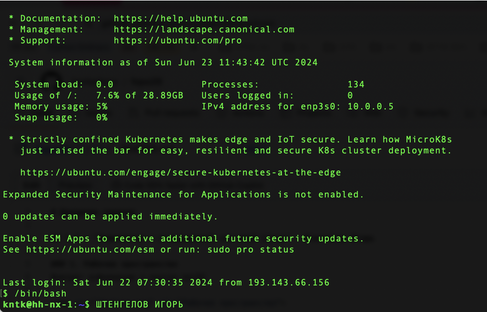
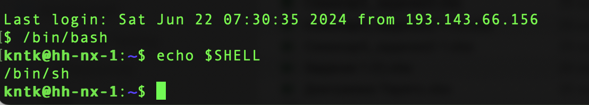
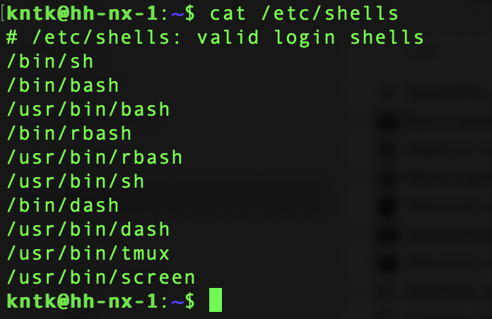
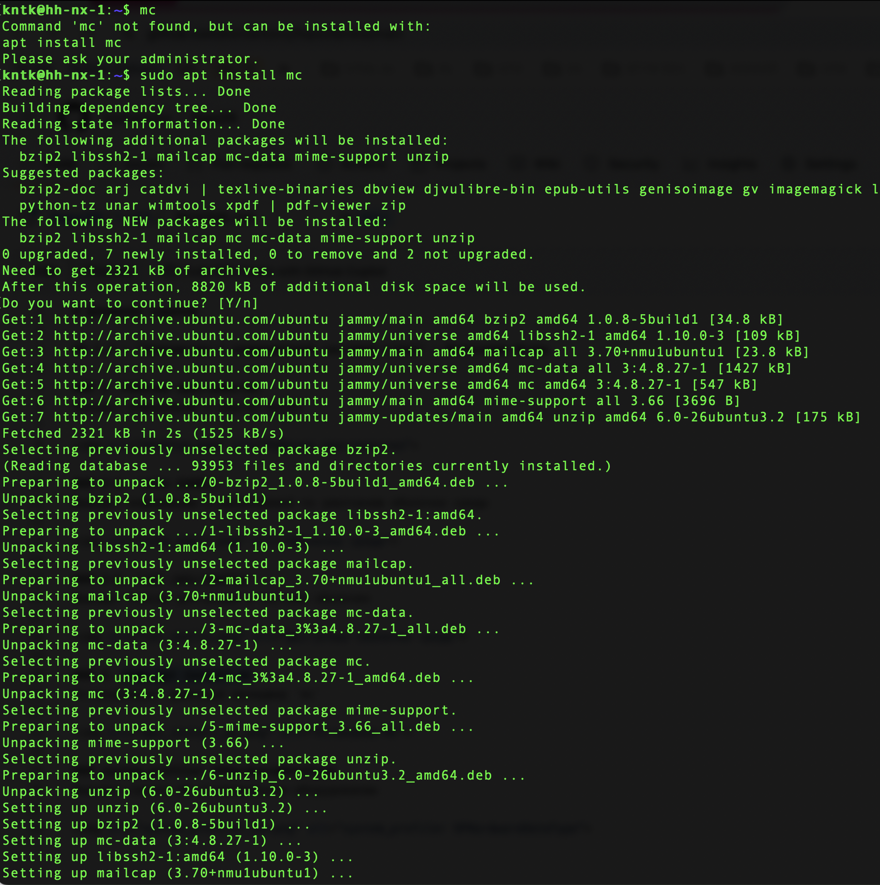
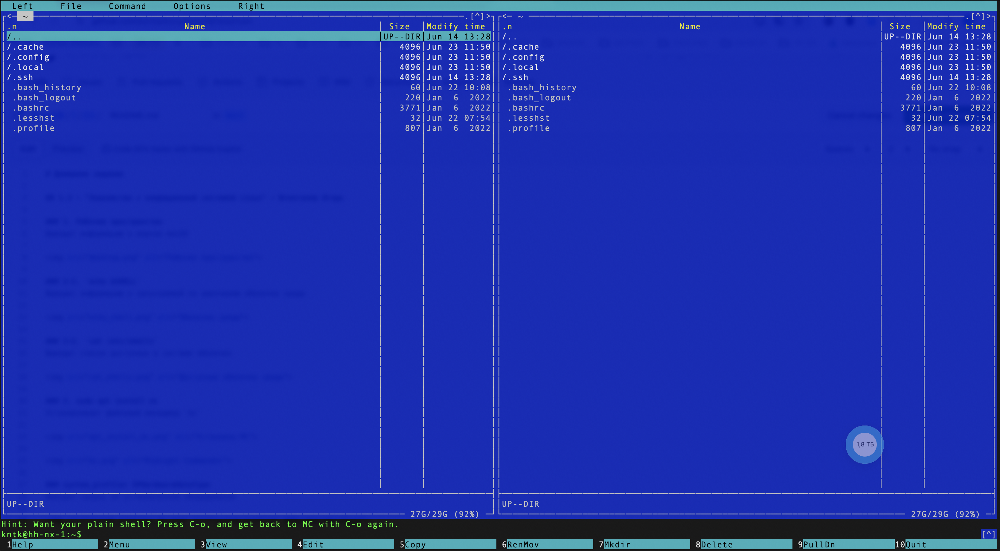
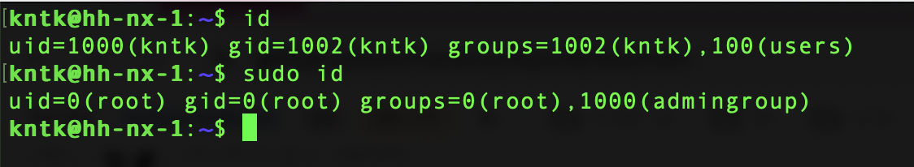

# Домашнее задание

## 1.3 - "Знакомство с операционной системой Linux" - Штенгелов Игорь

### 1. Рабочее пространство
Выводит информацию о версии macOS

### 2-1. `echo $SHELL`
Выводит информацию о запускаемой по умолчанию оболочки среды

### 2-2. `cat /etc/shells`
Выводит список доступных в системе оболочек

### 3. `sudo apt install mc`
Устанавливает файловый менеджер `mc`

### 4. `id` и `sudo id`
`id` - Выводит подробную информацию о текущем пользователе
`sudo id` - Выводит подробную информацию о суперпользователе

